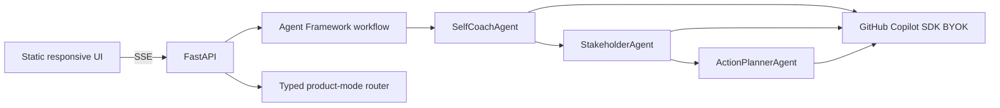

# Meeting Mirror

**Public web app:** <https://ca-meeting-mirror-ygp6sffvrfkjq.braveriver-91d86e5f.koreacentral.azurecontainerapps.io>

Meeting Mirror has two evidence-first modes: **발표 개선** for structure, clarity, evidence, repeated wording, Q&A, and rehearsal; and **회의 맥락·참여자 목적 분석** for self coaching, explicit stakeholder needs, verifiable hypotheses, and follow-up actions.

[](https://www.python.org/)
[](https://fastapi.tiangolo.com/)
[](https://github.com/microsoft/agent-framework)

## 심사위원 Quick Start / 최초 확인

1. **접속:** <https://ca-meeting-mirror-ygp6sffvrfkjq.braveriver-91d86e5f.koreacentral.azurecontainerapps.io> — 로그인 없음.
2. **권장 경로:** `회의 맥락·참여자 목적 분석` → `예시로 체험하기`의 한국어 샘플 불러오기(또는 파일/텍스트 입력) → 동의 체크 → **전문가 Agent 분석 시작**.
3. **대기:** 세 단계가 실시간 표시됩니다. 보통 3분 이내이며 시스템 상한은 4분입니다. 분석 중 새로고침하지 마세요.
4. **확인:** 한국어 `한눈에 보는 핵심` → 나의 코칭 → 발언자별 명시적 요청/가설/근거/확인 질문 → 실행 계획.

TXT/MD/PDF/DOCX를 지원합니다. 타임스탬프+화자 라벨이 새 발화를 시작하며, 문자 그대로의 `\n`과 여러 줄 계속 문장은 내용 손실 없이 이전 발화에 이어 붙입니다. 발표 개선과 회의 인사이트는 서로 다른 세 Agent 팀을 사용합니다(총 6개 전문 역할). 이는 **모드 라우팅 기반 agentic expert teams**이며 모델 수준 MoE 주장이 아닙니다.

배포는 Azure Container Apps이며, push마다 Ruff/pytest 품질 게이트 후 GitHub OIDC로 SHA 이미지 배포와 공개 smoke test를 실행합니다. 상태는 [`/health`](https://ca-meeting-mirror-ygp6sffvrfkjq.braveriver-91d86e5f.koreacentral.azurecontainerapps.io/health)와 [`/api/runtime`](https://ca-meeting-mirror-ygp6sffvrfkjq.braveriver-91d86e5f.koreacentral.azurecontainerapps.io/api/runtime)에서 확인할 수 있습니다. Production은 실제 GitHub Copilot SDK + Microsoft Agent Framework 경로만 사용하며 demo fallback은 거부합니다. 결과는 한국어로 요청·검증하되 표준 영문 약어·고유명사와 원문 인용은 유지될 수 있습니다. 구현 기준은 [PRD.md](PRD.md)와 [TRD.md](TRD.md)입니다.

## Public app

No login is required. Upload TXT/MD/PDF/DOCX, paste text, or open **예시로 체험하기**; select your speaker, confirm consent, and run the real three-agent pipeline. Production is AI-only and blocks analysis if the server-side Azure model is unavailable.

Meeting Mirror never treats a model’s interpretation as hidden truth. Explicit statements are separate from hypotheses, and every hypothesis includes evidence, confidence, and a question to verify with that person.

## Architecture



The app uses `agent-framework-github-copilot==1.0.3`, Agent Framework `WorkflowBuilder`, and six specialized `GitHubCopilotAgent` roles. A typed product-mode router selects exactly one disjoint three-agent team. This is **모드 라우팅 기반 Agentic MoE**, not a model-level mixture-of-experts claim.

Meeting Insight uses a real MAF fan-out/fan-in graph: SelfCoachAgent and StakeholderAgent run concurrently from one dispatcher, a typed aggregator joins both results, and ActionPlannerAgent synthesizes the final report. Before this optimization, verified public meeting runs on SHA `55f7215` took 66.87s and 115.25s; these are automated wall-clock observations, not a user study or productivity claim.

The page also includes an on-device meeting calendar backed by IndexedDB. Its seeded examples and user-saved metadata stay in that browser. Transcript/result persistence is opt-in and off by default. ICS export includes schedule metadata but never the transcript or inferred stakeholder details.

## Run locally

```powershell
python -m venv .venv
.\.venv\Scripts\python.exe -m pip install -e ".[dev]"
.\.venv\Scripts\uvicorn.exe app.main:app --reload
```

Open <http://127.0.0.1:8000>. Live analysis requires the server-side BYOK variables below. Developers can explicitly enable the rule-based test fixture with `ALLOW_DEMO_MODE=true`; production does not set it.

For live mode, copy `.env.example` values into the process environment. Never commit the key:

```powershell
$env:BYOK_PROVIDER_TYPE = "azure"
$env:BYOK_BASE_URL = "https://YOUR-RESOURCE.openai.azure.com/"
$env:BYOK_API_KEY = "..."
$env:BYOK_MODEL_ID = "gpt-4o-mini"
```

## Quality checks

```powershell
.\.venv\Scripts\python.exe -m pytest
.\.venv\Scripts\python.exe -m ruff check app tests
```

Tests cover transcript validation, all seven sample records, API errors, SSE stage progress, and response contracts.
They also cover both product contracts, TXT/MD/PDF/DOCX extraction, multi-file source attribution, live callback regression, calendar metadata, and Korean/Asia-Seoul ICS output.

## Deploy to Azure

The template deploys one public Azure Container App and uses an ACR remote build, so local Docker is not required.

```powershell
$env:AZURE_DEV_USER_AGENT = "microsoft_foundry_skill"
azd auth login
azd up --no-prompt
```

Add `BYOK_API_KEY` as a Container Apps secret and set the other BYOK environment variables after provisioning. Without them the Analyze CTA is blocked; there is no silent fallback.

When ACR Tasks are disabled by subscription policy, dispatch `.github/workflows/deploy.yml`. It builds the same Dockerfile on a GitHub-hosted runner and deploys the SHA-tagged image to the already provisioned Container App using Azure OIDC.

## Privacy and consent

The server processes files, transcripts, and results only in request memory and does not persist them. Azure request logs do not contain bodies. The optional calendar stores records only in the current browser’s IndexedDB; saving transcript/result content is a separate checkbox that defaults off. Obtain participant consent and remove confidential or sensitive information before analysis.

See [PRD.md](PRD.md) for acceptance criteria, [TRD.md](TRD.md) for precise SDK/deployment details, and [IDEATION.md](IDEATION.md) for scope decisions.

## Final submission checklist

- [ ] GitHub issue author is registered as the team leader.
- [ ] Repository URL starts with `https://github.com/<issue-author>/`.
- [ ] Submitted commit SHA exists on the remote and contains root `PRD.md` and `TRD.md`.
- [ ] Deployment URL is the raw public `https://*.azurecontainerapps.io` hostname.
- [ ] Root, health, samples, uploads, calendar, and both live modes pass `python scripts/smoke_public.py <URL> --live` without user credentials.
- [ ] All submission acknowledgements are checked; no more than two submissions are filed, and the latest is intended for judging.

Do not submit automatically. Confirm every item against the exact remote SHA and public URL first.
