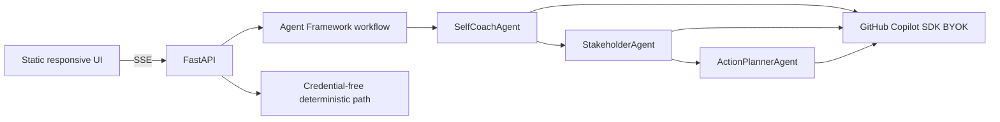

# Meeting Mirror

**Public web app:** <https://ca-meeting-mirror-ygp6sffvrfkjq.braveriver-91d86e5f.koreacentral.azurecontainerapps.io>

Meeting Mirror has two evidence-first modes: **발표 개선** for structure, clarity, evidence, repeated wording, Q&A, and rehearsal; and **회의 맥락·참여자 목적 분석** for self coaching, explicit stakeholder needs, verifiable hypotheses, and follow-up actions.

[](https://www.python.org/)
[](https://fastapi.tiangolo.com/)
[](https://github.com/microsoft/agent-framework)

## Demo

No login is required. Upload TXT/MD/PDF/DOCX, paste text, or open **예시로 체험하기**; select your speaker, confirm consent, and run the three-agent pipeline. The **빠른 기본 분석** path is rule-based and always available without credentials. The **AI 심층 분석** switch runs the real MAF + Copilot SDK route when the server reports it ready; the current Azure deployment is configured.

Meeting Mirror never treats a model’s interpretation as hidden truth. Explicit statements are separate from hypotheses, and every hypothesis includes evidence, confidence, and a question to verify with that person.

## Architecture



The real path uses `agent-framework-github-copilot==1.0.3`, an Agent Framework `WorkflowBuilder`, and three `GitHubCopilotAgent` instances. Copilot SDK BYOK targets Azure OpenAI or a Microsoft Foundry-compatible endpoint. The public judge path is deterministic and visibly labeled.

The page also includes an on-device meeting calendar backed by IndexedDB. Its seeded examples and user-saved metadata stay in that browser. Transcript/result persistence is opt-in and off by default. ICS export includes schedule metadata but never the transcript or inferred stakeholder details.

## Run locally

```powershell
python -m venv .venv
.\.venv\Scripts\python.exe -m pip install -e ".[dev]"
.\.venv\Scripts\uvicorn.exe app.main:app --reload
```

Open <http://127.0.0.1:8000>. Demo mode needs no environment variables.

For live mode, copy `.env.example` values into the process environment. Never commit the key:

```powershell
$env:BYOK_PROVIDER_TYPE = "azure"
$env:BYOK_BASE_URL = "https://YOUR-RESOURCE.openai.azure.com/"
$env:BYOK_API_KEY = "..."
$env:BYOK_MODEL_ID = "gpt-4o-mini"
```

## Quality checks

```powershell
.\.venv\Scripts\python.exe -m pytest
.\.venv\Scripts\python.exe -m ruff check app tests
```

Tests cover transcript validation, all seven sample records, API errors, SSE stage progress, and response contracts.
They also cover both product contracts, TXT/MD/PDF/DOCX extraction, multi-file source attribution, live callback regression, calendar metadata, and Korean/Asia-Seoul ICS output.

## Deploy to Azure

The template deploys one public Azure Container App and uses an ACR remote build, so local Docker is not required.

```powershell
$env:AZURE_DEV_USER_AGENT = "microsoft_foundry_skill"
azd auth login
azd up --no-prompt
```

For live mode, add `BYOK_API_KEY` as a Container Apps secret and set the other BYOK environment variables after provisioning. Without them the service defaults to the complete deterministic demo.

When ACR Tasks are disabled by subscription policy, dispatch `.github/workflows/deploy.yml`. It builds the same Dockerfile on a GitHub-hosted runner and deploys the SHA-tagged image to the already provisioned Container App using Azure OIDC.

## Privacy and consent

The server processes files, transcripts, and results only in request memory and does not persist them. Azure request logs do not contain bodies. The optional calendar stores records only in the current browser’s IndexedDB; saving transcript/result content is a separate checkbox that defaults off. Obtain participant consent and remove confidential or sensitive information before analysis.

See [PRD.md](PRD.md) for acceptance criteria, [TRD.md](TRD.md) for precise SDK/deployment details, and [IDEATION.md](IDEATION.md) for scope decisions.

## Final submission checklist

- [ ] GitHub issue author is registered as the team leader.
- [ ] Repository URL starts with `https://github.com/<issue-author>/`.
- [ ] Submitted commit SHA exists on the remote and contains root `PRD.md` and `TRD.md`.
- [ ] Deployment URL is the raw public `https://*.azurecontainerapps.io` hostname.
- [ ] Root, health, samples, and one full demo analysis pass `python scripts/smoke_public.py <URL>` without credentials.
- [ ] All submission acknowledgements are checked; no more than two submissions are filed, and the latest is intended for judging.

Do not submit automatically. Confirm every item against the exact remote SHA and public URL first.
