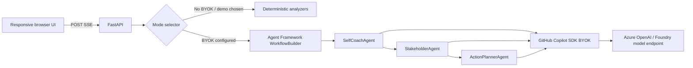

# Meeting Mirror — Technical Requirements and Design

## Runtime architecture

The application is one FastAPI service. It serves the static browser client, JSON APIs, and an SSE analysis endpoint. Azure Container Apps provides public HTTPS ingress. There is no database, queue, object storage, authentication layer, or transcript telemetry.



## SDK integration locations

- `app/agents.py` imports `WorkflowBuilder`, `WorkflowContext`, and `executor` from Microsoft Agent Framework.
- The same file imports `GitHubCopilotAgent` and `GitHubCopilotOptions` from `agent_framework.github`, supplied by pinned package `agent-framework-github-copilot==1.0.3`.
- `ProviderConfig` comes from pinned transitive package `github-copilot-sdk==1.0.2`. Its `type`, `base_url`, `api_key`, `wire_api`, and `model_id` route each Copilot session through BYOK.
- Three independently instructed `GitHubCopilotAgent` instances execute inside a `WorkflowBuilder` graph: `self-coach → stakeholder → action-planner`.
- Each node validates model JSON against Pydantic before passing its envelope to the next node.
- `app/pipeline.py` selects live mode whenever all required BYOK variables exist and the request mode is `auto`. A configured live failure is returned as an error; it is never disguised as demo output.

The container pins `@github/copilot==1.0.80` and sets `GITHUB_COPILOT_CLI_PATH`. BYOK sends model usage to the configured provider and does not rely on interactive Copilot user authentication.

Live workflow execution is capped by `LIVE_AGENT_TIMEOUT_SECONDS` (120 seconds by default). The three node outputs are not merely displayed independently: self coaching is added to the workflow envelope before stakeholder analysis, and both prior outputs are supplied to ActionPlannerAgent.

## API and data contracts

| Endpoint | Method | Purpose |
|---|---|---|
| `/` | GET | Browser application |
| `/health` | GET | Liveness/readiness |
| `/api/runtime` | GET | Reports live availability and effective default |
| `/api/samples` | GET | Structured built-in samples |
| `/api/parse` | POST | Validates transcript and returns speakers |
| `/api/analyze` | POST | Non-streaming typed analysis |
| `/api/analyze/stream` | POST | SSE progress plus final typed analysis |

`AnalysisRequest` contains `transcript`, `self_speaker`, `mode`, and `consent_confirmed`. `AnalysisResponse` contains pipeline metadata, `SelfCoaching`, one `StakeholderProfile` per other speaker, `ActionPlan`, provenance mode, and the disclaimer. Definitions live in `app/models.py`.

SSE events are JSON objects:

```json
{"type":"progress","stage":"self-coach","status":"running","detail":"..."}
{"type":"result","data":{"analysis_id":"...","mode":"demo"}}
```

## Azure topology

`azure.yaml` defines one `containerapp` service with `docker.remoteBuild: true`. `infra/main.bicep` and `infra/resources.bicep` create:

- one resource group;
- Basic Azure Container Registry;
- user-assigned managed identity with AcrPull;
- Log Analytics workspace and Container Apps managed environment;
- public HTTPS Container App with health probes, 0–2 replicas, 0.5 CPU, and 1 GiB memory.

The checked-in image is only a provisioning placeholder. `azd deploy` remotely builds the repository Dockerfile in ACR and replaces it.

If a subscription disables ACR Tasks, `.github/workflows/deploy.yml` is the supported build fallback: a GitHub-hosted runner builds the same Dockerfile, authenticates to Azure with OIDC (no client secret), pushes the SHA-tagged image to ACR, updates the same Container App, and checks `/health`. This preserves the raw `*.azurecontainerapps.io` deployment required by the submission validator.

## Secrets and configuration

Demo mode has no secrets. Live mode requires these Container App environment variables:

| Variable | Meaning |
|---|---|
| `BYOK_PROVIDER_TYPE` | `azure`, `openai`, or `anthropic`; Azure is the default |
| `BYOK_BASE_URL` | Provider base endpoint |
| `BYOK_API_KEY` | Static provider key, stored as a Container Apps secret |
| `BYOK_MODEL_ID` | Deployment/model ID |
| `BYOK_WIRE_API` | `completions` by default or `responses` |

Never commit these values or place them in deployment outputs. Configure the key with `az containerapp secret set` and reference it with `secretref:` in environment variables.

## Privacy, security, and retention

- Input is validated and capped before analysis.
- No endpoint writes transcripts or results to disk/database.
- Application logging does not log request bodies or agent prompts.
- In-memory request objects become collectible after the response; no application-level retention exists.
- HTTPS is enforced by Container Apps.
- ACR uses managed identity and RBAC rather than registry passwords.
- The UI requires a consent/authorization acknowledgment.

## Observability and errors

`/health` is used by liveness/readiness probes. Container stdout/stderr goes to Log Analytics for 30 days; transcript bodies are not emitted. Validation returns 400/422 with Korean guidance. Missing live configuration returns 503 on the non-streaming endpoint and an explicit SSE error on streaming. Invalid agent JSON fails the live request with the responsible agent name.

## Local and deployment procedure

```powershell
python -m venv .venv
.\.venv\Scripts\python.exe -m pip install -e ".[dev]"
.\.venv\Scripts\uvicorn.exe app.main:app --host 127.0.0.1 --port 8000
```

For Azure, set `AZURE_DEV_USER_AGENT=microsoft_foundry_skill` only in the command process, then run `azd up --no-prompt`. The Azure CLI and azd identities must be logged in, and the principal needs subscription deployment plus ACR build permissions. Validate `/health`, `/api/samples`, and one demo analysis after deploy.

## Automated-judge evidence map

| Evidence | Exact implementation | Observable result |
|---|---|---|
| MAF orchestration | `app/agents.py:run_live_pipeline`, three `@executor` nodes, `WorkflowBuilder.add_edge` | Named three-stage progress; prior context affects later output |
| Copilot SDK | `_make_agent`, `GitHubCopilotOptions`, `ProviderConfig` | `/api/runtime` reports live availability; result provenance says Live |
| Structured safety | `app/models.py`, model validation in every node | Separate explicit requests, hypotheses, confidence, quotes, confirmation question |
| Judge fallback | `app/demo_analyzer.py`, `_demo_pipeline` | Same complete response contract without credentials, labeled Deterministic demo |
| Browser UX | `app/static/index.html`, `app.js`, `styles.css` | Sample and speaker preselected; ordinary checkbox/button flow |
| Azure | `azure.yaml`, `infra/`, `.github/workflows/deploy.yml` | Public HTTPS Container App with health probes and SHA-tagged image |
| Tests | `tests/`, `scripts/smoke_public.py` | Parser/sample/API/SSE contracts and live public HTTP golden path |

## Deployment limitations

The current public environment intentionally has no BYOK model secret, so automated judges always have a reliable deterministic path. The production container includes the Copilot CLI and the live code path is selected automatically when BYOK settings exist. There is no application database, and no audio or external actions are implemented.
