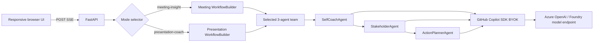

# Meeting Mirror — Technical Requirements and Design

## Runtime architecture

The application is one FastAPI service. It serves the static browser client, JSON/file APIs, and an SSE analysis endpoint. Azure Container Apps provides public HTTPS ingress. There is no server database, queue, object storage, authentication layer, or transcript telemetry. The browser calendar uses versioned IndexedDB; full transcript/result storage is explicit opt-in.



## SDK integration locations

- `app/agents.py` imports `WorkflowBuilder`, `WorkflowContext`, and `executor` from Microsoft Agent Framework.
- The same file imports `GitHubCopilotAgent` and `GitHubCopilotOptions` from `agent_framework.github`, supplied by pinned package `agent-framework-github-copilot==1.0.3`.
- `ProviderConfig` comes from pinned transitive package `github-copilot-sdk==1.0.2`. Its `type`, `base_url`, `api_key`, `wire_api`, and `model_id` route each Copilot session through BYOK.
- Meeting Insight now dispatches one normalized payload with `add_fan_out_edges` to SelfCoachAgent and StakeholderAgent concurrently, joins tagged branch results with `add_fan_in_edges`, then invokes ActionPlannerAgent. Each branch is independent; the typed aggregator proves both outputs exist before synthesis.
- Each node validates model JSON against Pydantic before passing its envelope to the next node.
- `app/pipeline.py` routes `product_mode` to one of two disjoint contracts and requires live configuration in production. Demo requests require `ALLOW_DEMO_MODE=true`, which production does not set.
- `app/presentation_agents.py` defines a distinct Structure → Clarity → Rehearsal workflow and validated presentation contract.
- `app/extraction.py` performs bounded in-memory TXT/MD/PDF/DOCX extraction and an Azure Speech-gated MP3 path. It validates extension, MIME, and PDF/DOCX/MP3 signatures.

The container pins `@github/copilot==1.0.80` and sets `GITHUB_COPILOT_CLI_PATH`. BYOK sends model usage to the configured provider and does not rely on interactive Copilot user authentication.

Live workflow execution is capped by `LIVE_AGENT_TIMEOUT_SECONDS` (120 seconds by default). The three node outputs are not merely displayed independently: self coaching is added to the workflow envelope before stakeholder analysis, and both prior outputs are supplied to ActionPlannerAgent.

## API and data contracts

| Endpoint | Method | Purpose |
|---|---|---|
| `/` | GET | Browser application |
| `/health` | GET | Liveness/readiness |
| `/api/runtime` | GET | Reports live availability and effective default |
| `/api/samples` | GET | Structured built-in samples |
| `/api/fixtures` | GET | First-party downloadable test files |
| `/api/extract`, `/api/extract/batch` | POST | Single/multi-file in-memory extraction |
| `/api/calendar` | POST | Standards-compliant, transcript-free ICS |
| `/api/parse` | POST | Validates transcript and returns speakers |
| `/api/analyze` | POST | Non-streaming typed analysis |
| `/api/analyze/stream` | POST | SSE progress plus final typed analysis |

`AnalysisRequest` contains transcript, selected speaker, product/engine modes, optional schedule, and consent. Meeting and presentation responses have separate typed contracts; both start with `ExecutiveSummary`. Definitions live in `app/models.py`.

SSE events are JSON objects:

```json
{"type":"progress","stage":"self-coach","status":"running","detail":"..."}
{"type":"result","data":{"analysis_id":"...","mode":"live"}}
```

## Azure topology

`azure.yaml` defines one `containerapp` service with `docker.remoteBuild: true`. `infra/main.bicep` and `infra/resources.bicep` create:

- one resource group;
- Basic Azure Container Registry;
- user-assigned managed identity with AcrPull;
- Log Analytics workspace and Container Apps managed environment;
- public HTTPS Container App with health probes, 0–2 replicas, 1 CPU, and 2 GiB memory (required for concurrent Copilot CLI processes).

The checked-in image is only a provisioning placeholder. `azd deploy` remotely builds the repository Dockerfile in ACR and replaces it.

If a subscription disables ACR Tasks, `.github/workflows/deploy.yml` is the supported build fallback: a GitHub-hosted runner builds the same Dockerfile, authenticates to Azure with OIDC (no client secret), pushes the SHA-tagged image to ACR, updates the same Container App, and checks `/health`. This preserves the raw `*.azurecontainerapps.io` deployment required by the submission validator.

## Secrets and configuration

Live mode requires these Container App environment variables:

| Variable | Meaning |
|---|---|
| `BYOK_PROVIDER_TYPE` | `azure`, `openai`, or `anthropic`; Azure is the default |
| `BYOK_BASE_URL` | Provider base endpoint |
| `BYOK_API_KEY` | Static provider key, stored as a Container Apps secret |
| `BYOK_MODEL_ID` | Deployment/model ID |
| `BYOK_WIRE_API` | `completions` by default or `responses` |

Never commit these values or place them in deployment outputs. Configure the key with `az containerapp secret set` and reference it with `secretref:` in environment variables.

## Privacy, security, and retention

- Input is validated and capped before analysis.
- No endpoint writes transcripts or results to disk/database.
- Uploaded files are read with 10MB/file, five-file, 25MB aggregate, and 60-second extraction limits. Temporary MP3 data is deleted in `finally`.
- IndexedDB calendar data never leaves the browser except schedule metadata intentionally included in analysis or ICS. Transcript/result save defaults off.
- Application logging does not log request bodies or agent prompts.
- In-memory request objects become collectible after the response; no application-level retention exists.
- HTTPS is enforced by Container Apps.
- ACR uses managed identity and RBAC rather than registry passwords.
- The UI requires a consent/authorization acknowledgment.

## Observability and errors

`/health` is used by liveness/readiness probes. Container stdout/stderr goes to Log Analytics for 30 days; transcript bodies are not emitted. Validation returns 400/422 with Korean guidance. Missing live configuration returns 503 on the non-streaming endpoint and an explicit SSE error on streaming. Invalid agent JSON fails the live request with the responsible agent name.

## Local and deployment procedure

```powershell
python -m venv .venv
.\.venv\Scripts\python.exe -m pip install -e ".[dev]"
.\.venv\Scripts\uvicorn.exe app.main:app --host 127.0.0.1 --port 8000
```

For Azure, set `AZURE_DEV_USER_AGENT=microsoft_foundry_skill` only in the command process, then run `azd up --no-prompt`. Every feature-branch/main push runs Ruff and pytest first, then OIDC image build/deploy and public root/runtime/upload/calendar smoke. The stable FQDN remains while SHA-tagged revisions change.

## Automated-judge evidence map

| Evidence | Exact implementation | Observable result |
|---|---|---|
| MAF orchestration | `app/agents.py:run_live_pipeline`, three `@executor` nodes, `WorkflowBuilder.add_edge` | Named three-stage progress; prior context affects later output |
| Copilot SDK | `_make_agent`, `GitHubCopilotOptions`, `ProviderConfig` | `/api/runtime` reports live availability; result provenance says Live |
| Structured safety | `app/models.py`, model validation in every node | Separate explicit requests, hypotheses, confidence, quotes, confirmation question |
| Production gate | `app/pipeline.py`, `/api/runtime` | Live only; unavailable configuration blocks instead of fabricating AI |
| Browser UX | `app/static/index.html`, `app.js`, `styles.css` | Sample and speaker preselected; ordinary checkbox/button flow |
| Azure | `azure.yaml`, `infra/`, `.github/workflows/deploy.yml` | Public HTTPS Container App with health probes and SHA-tagged image |
| Tests | `tests/`, `scripts/smoke_public.py` | Parser/sample/API/SSE contracts and live public HTTP golden path |

## Deployment limitations

The current public environment has a server-side Azure OpenAI BYOK secret and exposes only the real agent route. The key is a Container Apps secret and never appears in source, output, or logs. Azure Speech is not configured, so MP3 returns a clear unavailable message. Rule-based analyzers are gated to development/tests. MAF is Layer 1 and Container Apps/Bicep/azd are infrastructure; MCP and Aspire are intentionally absent because no justified remote-tool boundary requires them.

Sanitized verification evidence: a local real Meeting Insight run completed SelfCoachAgent → StakeholderAgent → ActionPlannerAgent with typed summary/stakeholder/action output in 86.16 seconds. The checkpoint public image completed a real streaming meeting run in 55.6 seconds. Final deployment verification runs both real modes again and records only status, latency, stage names/count, and contract presence.

## 평가 기준 대응 근거

| 공식 기준 | 확인 가능한 근거 |
|---|---|
| Copilot SDK + MAF · 25% | `app/agents.py:run_live_pipeline`의 실제 `add_fan_out_edges`/`add_fan_in_edges` 그래프, `app/presentation_agents.py`의 별도 순차 그래프, 총 6개 `GitHubCopilotAgent`, Pydantic 계약·한국어 재시도·SSE 단계. |
| 생산성/문제 적합성 · 18% | `한눈에 보는 핵심`, 본인 코칭, 발언자별 검증 질문, 담당/기한/행동, 복사·JSON·ICS. PRD의 5분 목표는 목표치이며 사용자 연구 결과로 주장하지 않음. |
| Azure · 18% | 공개 Container Apps URL, `infra/` Bicep, ACR managed-identity pull, Log Analytics, 헬스 프로브, 1 CPU/2Gi, GitHub OIDC SHA 이미지 배포. |
| 기능 완성도 · 16% | `/api/analyze/stream`, 240초 제한+heartbeat, literal `\\n`/연속 줄 전처리, TXT/MD/PDF/DOCX, 33+ pytest 및 push 품질 게이트. |
| UX · 12% | 반응형 두 모드 카드, 동적 3-Agent 진행, 취소·재시도·포커스, 파일 큐, IndexedDB 캘린더, copy/download. |
| RAI/보안 · 6% | 명시 사실/가설 분리, 인용·확신도·확인 질문, 동의와 로컬 저장 분리, prompt-injection 지시, CSP/HSTS, 비밀 미기록. |
| 혁신성 · 5% | 일반 요약이 아닌 개인 대화 행동 코치 + 이해관계자 목적 검증이며, 모드 라우팅 전문가 팀을 사용. |

공개 SHA `55f7215`에서 관찰한 Meeting Insight API 시간은 66.87초와 115.25초(각 3/3 단계 완료)였다. 이는 자동 API wall-clock 측정이며 사용자 시간 절감 연구가 아니다. 병렬 그래프 배포 후 같은 방식으로 다시 측정한다. MCP/Aspire는 외부 원격 도구 경계가 없어 형식적으로 추가하지 않았고, 외부 CRM/캘린더 연결이 생길 때 검토한다. Key Vault 전환은 향후 보안 로드맵이며 현재 키는 Container Apps secret으로 관리된다.
